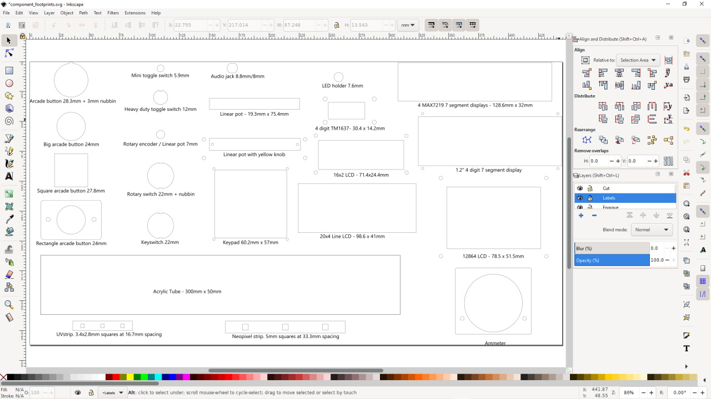
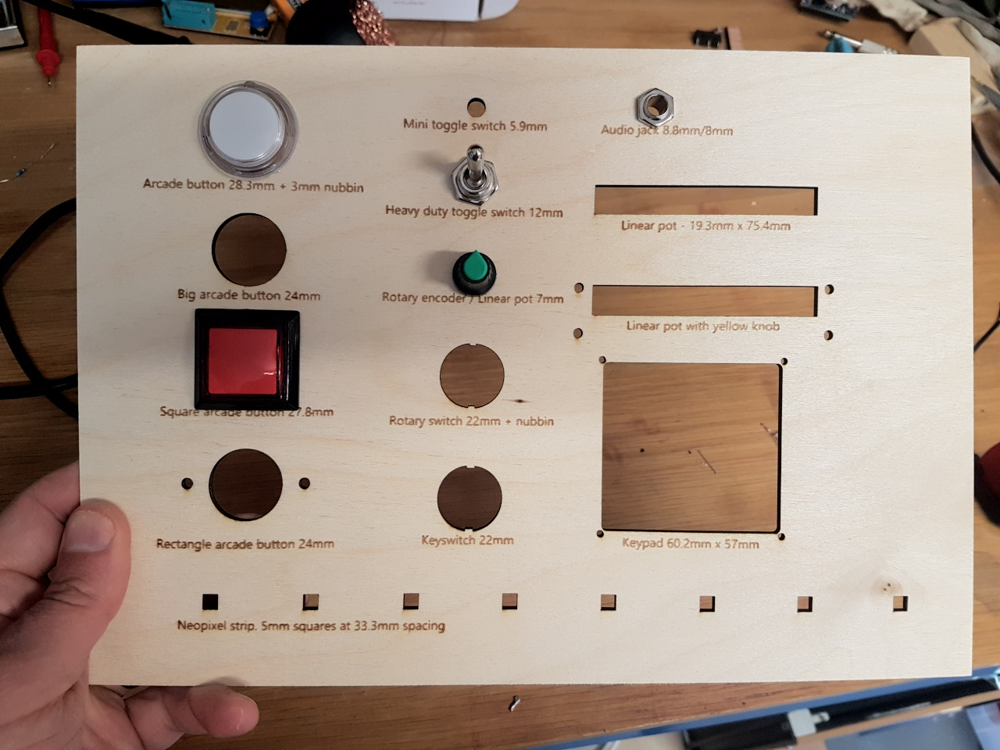

# component-footprints
An SVG library of footprints for various electronic components, at 1:1 scale, suitable for laying out designs, creating drill templates, laser cutting etc.

 
 

## Contents
 - TM1637 4-digit LED (https://www.banggood.com/custlink/GDD3zSq2qk)
 - 128x64px LCD  (https://www.banggood.com/custlink/G3vY8zzr27)
 - 20x04 character LCD (https://www.banggood.com/custlink/mG3EO6066Y)
 - 16x02 character LCD (https://www.banggood.com/custlink/GvGhl4eegC)
 - 5pcs Slide Potentiometer (https://www.banggood.com/custlink/vGGdLOO1zU)
 - Ammeter (https://www.aliexpress.com/item/10000020296910.html)
 - 5x Linear Potentiometer (https://www.banggood.com/custlink/vGGdLOO1zU)
 - 3-position Rotary Switch (https://www.banggood.com/custlink/3KmYl4B6oC)
 - 10pcs Mini Toggle Switch (https://www.banggood.com/custlink/33KhLg44oP)
 - 5pcs Heavy Duty Toggle Switch (https://www.banggood.com/custlink/GmmEL0ggoa)
 - 10pcs Illuminated Arcade Buttons (https://www.banggood.com/custlink/GGKyLB44jB)
 - 10pcs Linear Potentiometer (https://www.banggood.com/custlink/vvvYl6g4lQ)
 - 5pcs Slide Potentiometer (https://www.banggood.com/custlink/vGGdLOO1zU)
